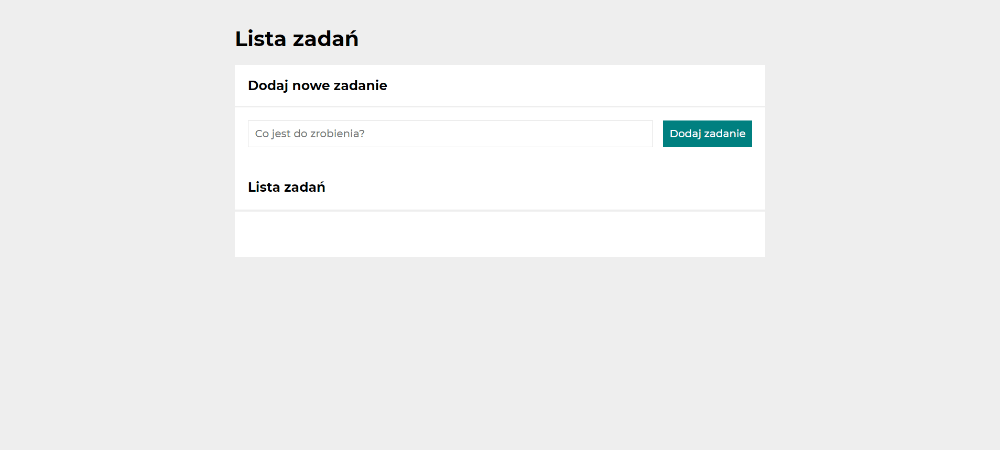

# To do list 📄
## Demo
[To do list](https://szymonuscinski27.github.io/to-do-list/)

## Description
It's a simply To do list app that can allow you adding and removing tasks that you plan to do. 

Additionally you can use "Ukończ wszystkie" button to make all tasks as done 
and "Pokaż/Ukryj ukończone" button to hide or show tasks that are already done.

Let me invite you to try this app! 

Below you can find out how this app works 🧐

## How it works? 😎

## Technology
- HTML
- CSS (included CSS: Flex and CSS: Grid, media queries)
- JavaScript (ES6+ features)

## Methodology
- BEM

### Author
Szymon Uściński

you can contact me at szymonuscinski@gmail.com
